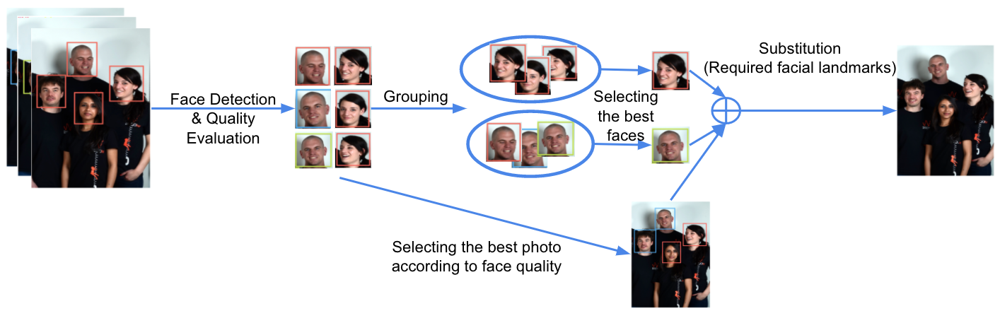
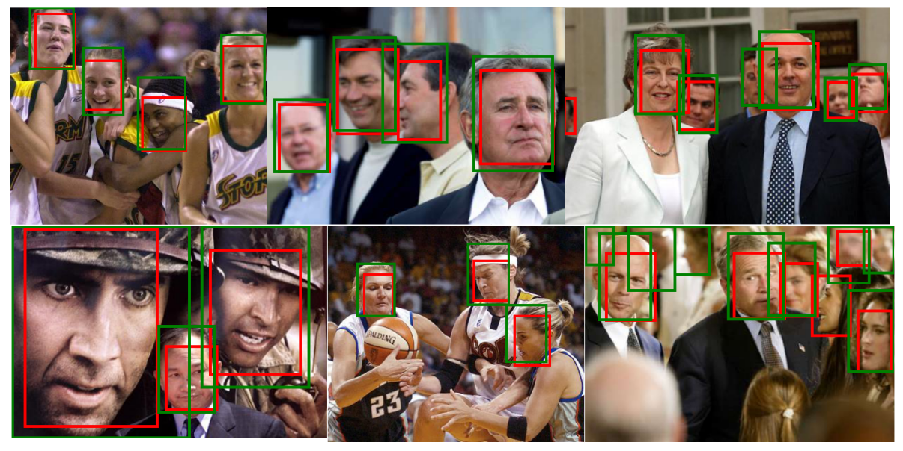
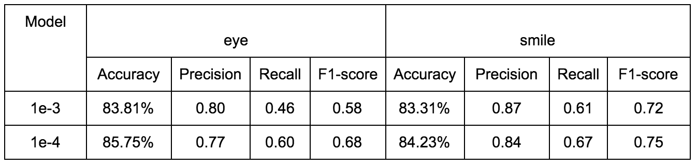
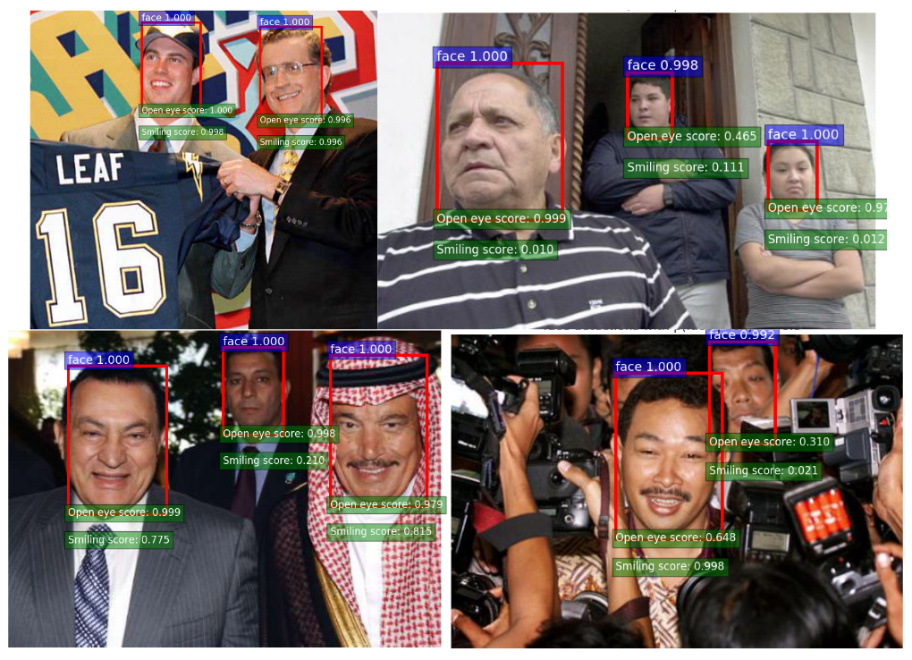

# Automatic Group Photography Enhancement

Have you ever experienced this? When a group photograph has been taken, we will always disappointingly find that some people are looking away, some people are closing their eyes and some people are exactly wearing a sad expression in that photograph. Inspired by this [paper](https://static.googleusercontent.com/media/research.google.com/zh-CN//pubs/archive/41101.pdf), our project aims at synthesizing a perfect group photograph automatically from a given set of group photos.

The system pipeline is as follows:



We built our system on top of the [Faster R-CNN](http://arxiv.org/pdf/1506.01497v3.pdf). Here we used a [TensorFlow implementation](https://github.com/smallcorgi/Faster-RCNN_TF).


### Requirements: software

1. Tensorflow (see: [Tensorflow](https://www.tensorflow.org/)). Please select appropriate version (GPU/CPU only) according to your machine.

2. Libraries you might not have: `dlib`

3. Python packages you might not have: `cython`, `python-opencv`, `easydict`, `ipython`


### Installation (for Faster R-CNN)

1. Clone the repository
  ```Shell
  # Make sure to clone with --recursive
  git clone --recursive git@github.com:Yuliang-Zou/Automatic_Group_Photography_Enhancement.git
  ```

2. Build the Cython modules
    ```Shell
    cd $ROOT/lib
    make
    ```


### Dataset

In this project, we used [WIDER](http://mmlab.ie.cuhk.edu.hk/projects/WIDERFace/) to train face detector, used [FDDB](http://vis-www.cs.umass.edu/fddb/) to train eye-closure and smile classifier (and fine-tune the face detector simultaneously).

In order to use the data iterator of VOC2007, we provide annotations of both dataset:

WIDER: [[Google Drive]](https://drive.google.com/drive/folders/0B2SnTpv8L4iLQllWbUpPM1N1eXc?usp=sharing)

FDDB(face detection only): [[Google Drive]](https://drive.google.com/drive/folders/0B2SnTpv8L4iLZy1UNFplMWY0QXM?usp=sharing)

FDDB(with eye-closure and smile labels): [[Google Drive]](https://drive.google.com/drive/folders/0B2SnTpv8L4iLYVlpMkIyOWRSWGM?usp=sharing)

**NOTE: ** some images in FDDB contain too many faces to annotate eye-closure and smile labels, we just ignore them.


### How to use the dataset
1. Download the training, validation, test data and VOCdevkit

  ```Shell
  wget http://host.robots.ox.ac.uk/pascal/VOC/voc2007/VOCtrainval_06-Nov-2007.tar
  wget http://host.robots.ox.ac.uk/pascal/VOC/voc2007/VOCtest_06-Nov-2007.tar
  wget http://host.robots.ox.ac.uk/pascal/VOC/voc2007/VOCdevkit_08-Jun-2007.tar
  ```

2. Extract all of these tars into one directory named `VOCdevkit2007`

  ```Shell
  tar xvf VOCtrainval_06-Nov-2007.tar
  tar xvf VOCtest_06-Nov-2007.tar
  tar xvf VOCdevkit_08-Jun-2007.tar
  ```

3. It should have this basic structure

  ```Shell
    $VOCdevkit2007/                           # development kit
    $VOCdevkit2007/VOCcode/                   # VOC utility code
    $VOCdevkit2007/VOC2007                    # image sets, annotations, etc.
    # ... and several other directories ...
    ```

4. Create symlinks for the PASCAL VOC dataset

  ```Shell
    cd $FRCN_ROOT/data
    ln -s $VOCdevkit VOCdevkit2007
    ```

5. Create a folders for WIDER and FDDB

  1) Move the `images/` folder of WIDER to `VOCdevkit2007/VOC2007/JPEGImages/`, and rename it as `WIDER/`

  2) Move the downloaded annotations of WIDER to `VOCdevkit2007/VOC2007/Annotations` (the folder should be named as `WIDER/`)

  3) Move the two folders (`2002/` and `2003/`) of FDDB to `VOCdevkit2007/VOC2007/JPEGImages/`

  4) Move the downloaded annotations of FDDB to `VOCdevkit2007/VOC2007/Annotations` (You can't use old annotation and new annotation at the same time)
 
  5) Don't forget the set training/val/test set in `VOCdevkit2007/VOC2007/ImageSets/Main/`. (We here provide examples for you, you can download along with the annotation files)


### Model

Pretrained ImageNet model 
[npy](https://drive.google.com/open?id=0ByuDEGFYmWsbNVF5eExySUtMZmM), [or this](https://www.dropbox.com/s/po2kzdhdgl4ix55/VGG_imagenet.npy?dl=0)

Faster R-CNN model trained on VOC2007 
[ckpt](https://drive.google.com/open?id=0ByuDEGFYmWsbZ0EzeUlHcGFIVWM), [npy](https://drive.google.com/file/d/0B2SnTpv8L4iLSmh0czgyMmFIZFE/view?usp=sharing)

Face Detection model
[ckpt](https://drive.google.com/file/d/0B2SnTpv8L4iLbmNsOXZvcDFFd0U/view?usp=sharing), [npy](https://drive.google.com/file/d/0B2SnTpv8L4iLVzRJQmNFRUpSSEE/view?usp=sharing)

Eye-closure and smile
[ckpt](https://drive.google.com/file/d/0B2SnTpv8L4iLZVpFTnA2NDRsQ2M/view?usp=sharing)

*NOTE: You can use `npy` files as initialization, while use `ckpt` files to test and perform certain tasks. `ckpt` files can be transformed into `npy`, please check the code in `$ROOT/lib/networks/newtork.py`*


### Training and Testing

1. If you want to train and test the face detector, you can clone the repository from the [TensorFlow version Faster R-CNN](https://github.com/smallcorgi/Faster-RCNN_TF), and modify some funtions in `$ROOT/lib/` to do this.

2. If you want to train and test the eye-closure and smile utilities, you can run the following codes:

```Shell
cd $FRCN_ROOT
python tools/train_net.py --weights model/VGGnet_fast_rcnn_wider_iter_70000.npy --imdb voc_2007_trainval --iters 100000 --cfg experiments/cfgs/faster_rcnn_end2end.yml --network VGGnet_train
```

or

```Shell
cd $FRCN_ROOT
python tools/test_yl.py  --model model/VGGnet_fast_rcnn_full_eye_smile_1e-4_iter_70000.ckpt --net VGGnet_test
```


### Experiment results 

1) Face detector

The AP on the WIDER training set is `0.328`. The AP on the whold FDDB dataset is `0.902`.

Some examples:



(Green box: ground truth, red box: prediction)

2) Eye-closure and smile classification



Some examples:



### Demo

*After successfully completing basic installation*, you'll be ready to run the demo.


